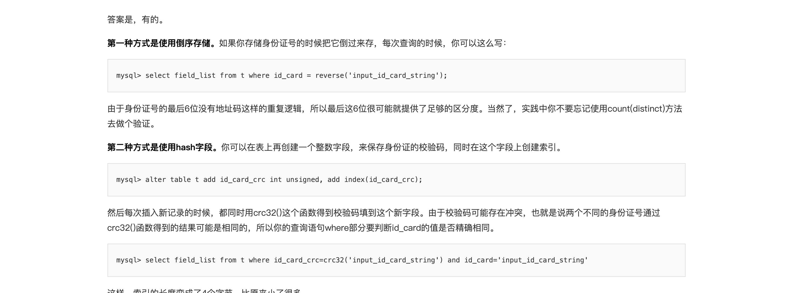

#### 04 索引

#### 09 普通索引和唯一索引

// 身份证号太长了 不适合做主键  用来做索引
select name from CUser where id_card = 'xxxxxxxyyyyyyzzzzz';
要么给id_card字段创建唯一索引，要么创建一个普通索引

#### 前缀索引 邮箱登陆的例子
MySQL是支持前缀索引的，也就是说，你可以定义字符串的一部分作为索引

mysql> create table SUser(
ID bigint unsigned primary key,
email varchar(64), 
... 
)engine=innodb; 

mysql> select f1, f2 from SUser where email='xxx';

mysql> alter table SUser add index index1(email);
或
mysql> alter table SUser add index index2(email(6));

身份证倒过来存储 增加区分度 
mysql> select field_list from t where id_card = reverse('input_id_card_string');

保存身份证的校验码
mysql> alter table t add id_card_crc int unsigned, add index(id_card_crc);
select field_list from t where id_card_crc=crc32('input_id_card_string') and id_card='input_id_card_string'

